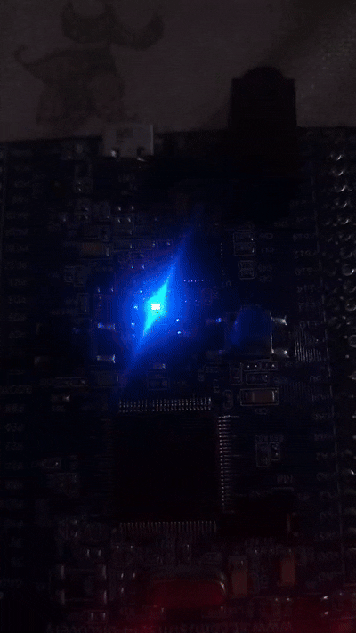

---
sidebar_position: 2
slug: /1-1-multiple-led-blink
title: 1.1. Multiple LED Blink (Modular Functions)
description: Master modular programming patterns by refactoring GPIO control into reusable functions
keywords: [STM32, GPIO, modular programming, functions, code organization]
---

# Task 1.1: Multiple LED Blink (Modular Functions)

Now that you understand GPIO basic operation, let's apply **professional software engineering practices** by refactoring the blinking code into **modular, reusable functions**.

## Learning Objectives

By the end of this task, you will:
- 🎯 Implement **reusable GPIO functions**
- 🎯 Understand **function abstraction** in embedded systems
- 🎯 Control **multiple GPIO pins** with elegant code
- 🎯 Apply **DRY principle** (Don't Repeat Yourself)
- 🎯 Write **clean, maintainable embedded code**

## Prerequisites

- ✅ Complete Lab 1 (understand GPIO basics)
- ✅ Familiar with C functions
- ✅ Understand bitwise operations

## Theory: Modular Design

### Why Modular Code?

```
Non-Modular (Lab 1):
├─ 100+ lines of repetitive code
├─ Hard to add a new LED
└─ Error-prone copy-paste

Modular (Lab 1.1):
├─ Reusable functions
├─ Change one function = affects all LEDs
└─ Scalable and maintainable
```

### Function Abstraction Pattern

```c
// Instead of:
GPIOD_MODER &= ~(3 << (12*2));
GPIOD_MODER |=  (1 << (12*2));

// Create a function:
void configure_output(int pin) {
    GPIOD_MODER &= ~(3 << (pin*2));
    GPIOD_MODER |=  (1 << (pin*2));
}

// Usage:
configure_output(12);
configure_output(13);
configure_output(14);
configure_output(15);  // Scales elegantly!
```

## Hardware Reference

| LED | Pin | Connection |
|-----|-----|-----------|
| Green | PD12 | GPIOD bit 12 |
| Orange | PD13 | GPIOD bit 13 |
| Red | PD14 | GPIOD bit 14 |
| Blue | PD15 | GPIOD bit 15 |

## Demo: Sequential LED Blinking



*LEDs light up sequentially in a flowing pattern*

## The Code

```c
// ==================== REGISTER DEFINITIONS ====================
#define RCC_BASE 0x40023800UL
#define RCC_AHB1ENR *(volatile unsigned int*)(RCC_BASE + 0x30U)

#define GPIO_D_BASE 0x40020C00UL
#define GPIOD_MODER *(volatile unsigned int*)(GPIO_D_BASE + 0x00U)
#define GPIOD_ODR   *(volatile unsigned int*)(GPIO_D_BASE + 0x14U)

// ==================== FUNCTION DEFINITIONS ====================

/**
 * Delay function - creates visible pause
 * ~150000 iterations ≈ 1 second
 */
void led_delay(void) {
    for (volatile int i = 0; i < 150000; i++);
}

/**
 * Configure a GPIO pin as output
 * 
 * Parameter:
 *   - n: Pin number (12, 13, 14, 15)
 * 
 * Operation:
 *   1. Clear the 2-bit mode field for pin n
 *   2. Set to 01 mode (General Purpose Output)
 *   3. Initialize pin to LOW (OFF state)
 */
void configure_output(int n) {
    // Clear the 2 bits for mode configuration
    GPIOD_MODER &= ~(3 << (n * 2));
    
    // Set to output mode (01)
    GPIOD_MODER |= (1 << (n * 2));
    
    // Initialize to LOW (LED off)
    GPIOD_ODR &= ~(1 << n);
}

/**
 * Turn on an LED (set pin HIGH)
 * 
 * Parameter:
 *   - n: Pin number
 * 
 * Side effect: Includes delay for visible effect
 */
void led_on(int n) {
    GPIOD_ODR |= (1 << n);
    led_delay();
}

/**
 * Turn off an LED (clear pin to LOW)
 * 
 * Parameter:
 *   - n: Pin number
 * 
 * Side effect: Includes delay for visible effect
 */
void led_off(int n) {
    GPIOD_ODR &= ~(1 << n);
    led_delay();
}

/**
 * Toggle an LED state (ON→OFF or OFF→ON)
 * 
 * Parameter:
 *   - n: Pin number
 */
void led_toggle(int n) {
    GPIOD_ODR ^= (1 << n);
}

// ==================== MAIN PROGRAM ====================

int main(void) {
    // ========== SYSTEM INITIALIZATION ==========
    // Enable clock for GPIOD port
    RCC_AHB1ENR |= (1 << 3);
    
    // ========== GPIO PIN CONFIGURATION ==========
    // Configure all four LED pins as outputs
    configure_output(12);  // Green
    configure_output(13);  // Orange
    configure_output(14);  // Red
    configure_output(15);  // Blue
    
    // ========== MAIN LOOP - Sequential Blinking ==========
    while (1) {
        // Turn on all LEDs
        led_on(12);
        led_on(13);
        led_on(14);
        led_on(15);
        
        // Turn off all LEDs
        led_off(12);
        led_off(13);
        led_off(14);
        led_off(15);
    }
    
    return 0;
}
```

## Execution Flow

```
Start
  ↓
Enable GPIOD Clock
  ↓
Configure Pins 12-15 as Outputs (all initialized LOW)
  ↓
Loop:
  ├─ led_on(12)  → PD12 HIGH, wait
  ├─ led_on(13)  → PD13 HIGH, wait
  ├─ led_on(14)  → PD14 HIGH, wait
  ├─ led_on(15)  → PD15 HIGH, wait
  ├─ led_off(12) → PD12 LOW, wait
  ├─ led_off(13) → PD13 LOW, wait
  ├─ led_off(14) → PD14 LOW, wait
  ├─ led_off(15) → PD15 LOW, wait
  └─ Repeat infinitely
```

## Code Improvements Over Lab 1

### Before (Lab 1)
```c
// Repetitive, error-prone
GPIOD_MODER &= ~(3 << (12*2)); GPIOD_MODER |= (1 << (12*2));
GPIOD_MODER &= ~(3 << (13*2)); GPIOD_MODER |= (1 << (13*2));
GPIOD_MODER &= ~(3 << (14*2)); GPIOD_MODER |= (1 << (14*2));
GPIOD_MODER &= ~(3 << (15*2)); GPIOD_MODER |= (1 << (15*2));
```

### After (Lab 1.1)
```c
// Clean, maintainable
configure_output(12);
configure_output(13);
configure_output(14);
configure_output(15);
```

## Key Benefits

| Aspect | Lab 1 | Lab 1.1 |
|--------|-------|---------|
| **Lines of Code** | 30+ | 15+ |
| **Readability** | Low | High |
| **Maintainability** | Hard | Easy |
| **Reusability** | No | Yes |
| **Bug Proneness** | High | Low |
| **Extensibility** | Difficult | Trivial |

## Alternative: Knight Rider Pattern

```c
// Create a "cylon scanner" effect
void knight_rider(void) {
    while (1) {
        for (int i = 12; i <= 15; i++) {
            GPIOD_ODR &= ~(0xF << 12);    // Clear all
            GPIOD_ODR |= (1 << i);         // Turn on one
            led_delay();
        }
        
        for (int i = 14; i >= 13; i--) {
            GPIOD_ODR &= ~(0xF << 12);    // Clear all
            GPIOD_ODR |= (1 << i);         // Turn on one
            led_delay();
        }
    }
}
```

## Common Mistakes

| Mistake | Effect | Fix |
|---------|--------|-----|
| Forgot to clear MODER bits | Pin not configured as output | Use `&= ~(3 << ...)` first |
| Function doesn't match usage | Compilation or runtime errors | Check function signatures |
| Wrong bit positions | Controlling different pins | Verify bit calculations |
| Missing initialization loop | LEDs behave unpredictably | Configure all pins before loop |

## Advantages of This Approach

✅ **Scalability**: Adding a 5th LED is one line: `configure_output(16);`

✅ **Maintainability**: Bug fix in `led_on()` benefits all uses

✅ **Readability**: Code reads like English: `led_on(12); led_off(12);`

✅ **Testing**: Each function can be tested independently

✅ **Professional**: This is how production embedded code is organized

## Challenge Exercises

### Challenge 1: All-At-Once Control
```c
/**
 * Create an all_leds_on() function
 * Turns on all four LEDs simultaneously
 * Hint: Use bit-OR to set multiple bits at once:
 * GPIOD_ODR |= (0xF << 12);
 */
void all_leds_on(void) {
    // YOUR CODE HERE
}

// Same for all_leds_off()
```

### Challenge 2: Custom Patterns
```c
void pattern_pulse(void) {
    // Each LED turns on for 0.5s then off, in sequence
    // 12 ON → OFF → 13 ON → OFF → etc.
}

void pattern_chase(void) {
    // LEDs light up like a chaser: 12→13→14→15→12→...
}
```

### Challenge 3: Blinking Separately
```c
/**
 * Make two LEDs blink at different rates:
 * LED 12: 0.5s on, 0.5s off
 * LED 15: 1s on, 1s off (slower)
 * Hint: You'll need to structure the timing differently
 * (This is still tricky without timers—we'll solve this in Lab 8!)
 */
```

## Expected Output

```
Time:  0s                  1s                  2s
       ↓                   ↓                   ↓
Pin 12 [HIGH]........ → [LOW]
       
Pin 13           [HIGH]........ → [LOW]
       
Pin 14                   [HIGH]........ → [LOW]
       
Pin 15                               [HIGH]........ → [LOW]

Visual: Sequential lighting, then all-off, repeats
```

## Best Practices Learned

✨ **Key Points:**

1. **DRY Principle** - Don't Repeat Yourself
   - Write once, use many times

2. **Function Abstraction** - Hide complexity
   - Caller doesn't need to know register details

3. **Clear Naming** - Code readability
   - `led_on()` is obvious; `GPIOD_ODR |=` is not

4. **Parameter-Driven** - Generic functions
   - Same `led_on()` works for any pin

5. **Documentation** - Comment the interface
   - Future you will thank present you

## Next Steps

🚀 **Ready for Lab 2?** You'll learn **Bitwise operations** with dual LED toggling and create interesting visual patterns!

### Skills You'll Need for Lab 2
- ✅ Comfortable with functions
- ✅ Understand XOR operation (^)
- ✅ Can modify delays

---

**Pro Tip:** Save this function library! You'll reuse these functions throughout all future labs!
