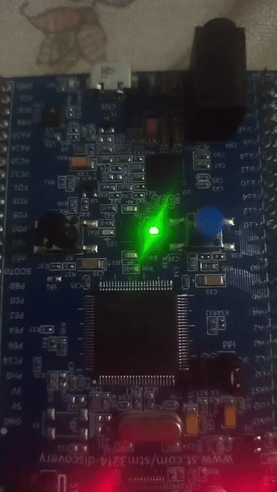

---
sidebar_position: 1
slug: /1-led-blink-basic-gpio
title: 1. LED Blink (Basic GPIO Output)
description: Learn the basics of GPIO by blinking an LED using bare-metal C. Master register-level programming fundamentals.
keywords: [STM32, GPIO, LED, blink, microcontroller, embedded systems, bare-metal]
---

# Lab 1: LED Blink (Basic GPIO Output)

Welcome to your first STM32 embedded systems program! In this lab, you'll master the **fundamental concept of GPIO output control** by creating a blinking LED using bare-metal C programming.

## Learning Objectives

By the end of this lab, you will understand:
- 🎯 **RCC (Reset and Clock Control)** - Clock distribution to peripherals
- 🎯 **GPIO Initialization** - Configure pins for output
- 🎯 **Register Manipulation** - Direct hardware control via memory addresses
- 🎯 **Output Data Register (ODR)** - Control pin voltage levels
- 🎯 **Software Delays** - Create timing in embedded systems

## Prerequisites

- Basic C programming (variables, loops, functions)
- Understanding of hexadecimal notation
- Basic digital logic (HIGH/LOW, binary)

## Hardware Required

| Component | Details |
|-----------|---------|
| **Microcontroller** | STM32F407VG or STM32F407ZG (STM32F4 Discovery) |
| **LED** | Onboard LED at GPIOD pin 12 (typically red) |
| **Connection** | Already soldered on the discount board |
| **Power Supply** | USB or external 5V/3.3V adapter |

## Theory: How GPIO Works

### The GPIO Block Diagram

```
Clock Source (RCC)
       ↓
    GPIO Port
    ↙  ↓  ↘
   Input Output Special
```

### 3-Step Process

#### Step 1: Enable Clock (RCC)
```
Before any GPIO operation, you must ENABLE the clock to that port.
Without clock, the GPIO port is powered down (low power mode).

RCC_AHB1ENR |= (1 << 3);  // Enable clock to GPIOD (bit 3)
```

#### Step 2: Configure Pin as Output (MODER)
```
Each GPIO pin can be:
- 00: Input
- 01: General Purpose Output
- 10: Alternate Function
- 11: Analog

For 2-bit configuration per pin, pin N uses bits [2N+1:2N]

GPIOD pin 12 uses bits [25:24]
GPIOD_MODER |= (1 << 24);  // Set PD12 as output
```

#### Step 3: Write to Output Data Register (ODR)
```
Once configured as output, write to the ODR register to control voltage:
- 1 = Pin goes HIGH (3.3V) → LED ON
- 0 = Pin goes LOW (0V)    → LED OFF

GPIOD_ODR |= (1 << 12);   // Set PD12 HIGH
GPIOD_ODR &= ~(1 << 12);  // Clear PD12 (LOW)
```

### Register Reference

| Register | Full Name | Purpose | Address |
|----------|-----------|---------|---------|
| **RCC_AHB1ENR** | AHB1 Enable Register | Control clock to GPIO ports | 0x40023830 |
| **GPIOD_MODER** | Port Mode Register | Configure pin direction | 0x40020C00 |
| **GPIOD_ODR** | Output Data Register | Control pin output value | 0x40020C14 |

## Demo: Visual Output



*The onboard LED blinks on and off repeatedly*

## The Code

```c
// ==================== REGISTER DEFINITIONS ====================
// Base address for RCC (Reset and Clock Control)
#define RCC_BASE 0x40023800UL

// AHB1 Enable Register (clock distribution)
#define RCC_AHB1ENR *(volatile unsigned int*)(RCC_BASE + 0x30U)

// ==================== GPIO PORT D ====================
// Base address for GPIO Port D
#define GPIO_D_BASE 0x40020C00UL

// Mode Register (configure as input/output)
#define GPIOD_MODER *(volatile unsigned int*)(GPIO_D_BASE + 0x00U)

// Output Data Register (control pin voltage)
#define GPIOD_ODR   *(volatile unsigned int*)(GPIO_D_BASE + 0x14U)

// ==================== DELAY FUNCTION ====================
/**
 * Simple software delay using CPU loop
 * Creates visible delay for LED blinking
 * Approximate: 150000 iterations ≈ 1 second (varies by clock speed)
 */
void led_delay(void) {
    for (volatile int i = 0; i < 150000; i++);
}

// ==================== MAIN PROGRAM ====================
int main(void) {
    // ========== STEP 1: ENABLE CLOCK TO PORT D ==========
    // Set bit 3 in RCC_AHB1ENR to enable GPIOD clock
    // Without this, GPIO D cannot function
    RCC_AHB1ENR |= (1 << 3);
    
    // ========== STEP 2: CONFIGURE PIN AS OUTPUT ==========
    // Pin number we're using
    int pin = 12;
    
    // Clear the 2 bits for this pin in MODER
    // For pin 12: clear bits [25:24]
    GPIOD_MODER &= ~(3 << (pin * 2));
    
    // Set bits to 01 (General Purpose Output mode)
    GPIOD_MODER |= (1 << (pin * 2));
    
    // Initialize pin to LOW (LED OFF state)
    GPIOD_ODR &= ~(1 << pin);

    // ========== STEP 3: BLINK FOREVER ==========
    while (1) {
        // Turn LED ON (set pin HIGH = 3.3V)
        GPIOD_ODR |= (1 << pin);
        
        // Wait (visible to human eye)
        led_delay();
        
        // Turn LED OFF (clear pin = 0V)
        GPIOD_ODR &= ~(1 << pin);
        
        // Wait before next cycle
        led_delay();
    }
    
    return 0;  // Never reached (infinite loop)
}
```

## Step-by-Step Execution Walkthrough

### Initialization Phase
```
1. RCC_AHB1ENR |= (1 << 3)
   └─ Powers on GPIO Port D
   
2. GPIOD_MODER configuration
   └─ Sets pin 12 as output mode (01)
   
3. GPIOD_ODR &= ~(1 << 12)
   └─ Initializes pin to LOW (safe state)
```

### Main Loop (Repeats Forever)
```
Cycle 1:
├─ GPIOD_ODR |= (1 << 12)    → Pin HIGH → LED ON
├─ led_delay()               → Hold for ~1 second
├─ GPIOD_ODR &= ~(1 << 12)   → Pin LOW → LED OFF
└─ led_delay()               → Hold for ~1 second
         ↓
Cycle 2: (Repeat infinitely)
```

## Understanding the Macros

### What is `volatile unsigned int*`?

```c
#define GPIOD_ODR *(volatile unsigned int*)(GPIO_D_BASE + 0x14U)
                   ↑
                   Memory pointer to hardware register

// This means:
// 1. (GPIO_D_BASE + 0x14U)     = Memory address (0x40020C14)
// 2. (volatile unsigned int*)  = Cast to pointer type
// 3. *                         = Dereference to get the value
// 4. Using |= or &=            = Modify the register
```

### Why `volatile`?

```
volatile tells the compiler:
- Don't optimize this variable away
- This value can change unexpectedly (hardware modifies it)
- Always read/write from actual memory, not a cached register
```

## Expected Output

```
Timeline:
├─ t=0s:   LED ON  (bright red)
├─ t=1s:   LED OFF (dark)
├─ t=2s:   LED ON  (bright red)
├─ t=3s:   LED OFF (dark)
└─ ...continues indefinitely
```

**Visual:** A smoothly blinking red LED at approximately 0.5 Hz (one blink per second)

## Common Mistakes & Fixes

| Mistake | Problem | Fix |
|---------|---------|-----|
| Forgot `AHB1_ENR` | GPIO port has no clock, won't work | Add clock enable for GPIOD |
| Wrong pin number | Controlling different LED or wrong pin | Verify with board schematic |
| Forgot `~(3 << ...)` | Pin not cleared before setting | Always clear bits first |
| No `volatile` keyword | Compiler optimizes away register access | Add `volatile` to all hardware registers |
| Delay too short | LED blinks too fast to see | Increase delay iterations |

## Troubleshooting

### LED Doesn't Blink
```
✓ Check: Is the board powered? (LED should be dim even before code)
✓ Check: Is GPIOD clock enabled in RCC?
✓ Check: Is pin 12 actually an output? (MODER configuration)
✓ Check: Did you flash the code correctly?
```

### LED Always ON or Always OFF
```
✓ Check: Are the ON/OFF commands reversed?
✓ Check: Is the delay so short it appears always on?
✓ Check: Is pin 12 available on your specific board?
```

### Strange Behavior
```
✓ Reduce frequency of changes (increase delay)
✓ Verify register addresses match your STM32 model
✓ Use a debugger to inspect register values
```

## Key Takeaways

✨ **Remember:**
1. GPIO requires **3 essential steps**: Clock → Config → Control
2. **Register addresses** map directly to hardware
3. **Bitwise operations** efficiently control individual pins (no bit-banging overhead)
4. **`volatile`** prevents the compiler from optimizing away hardware operations
5. **Delays** are basic timing in embedded systems (later we'll use timers)

## Challenge Exercises

### Challenge 1: Faster Blinking
```c
// Modify the delay function to blink twice as fast
// Hint: Reduce the loop iteration count
```

### Challenge 2: Multiple LEDs
```c
// The board has LEDs at pins 12, 13, 14, 15
// Modify to blink each LED sequentially:
// 12 → 13 → 14 → 15 → repeat
// Don't turn on the next until previous is off
```

### Challenge 3: Custom Pattern
```c
// Create a pattern: 2 quick blinks, 1 second pause, repeat
// Sequence: ON (100ms) → OFF (100ms) → ON (100ms) → OFF (1000ms)
```

## Next Steps

🚀 **Ready for Lab 1.1?** You'll refactor this code into **modular functions** for better code organization and reusability!

### Prerequisites for Lab 1.1
- ✅ Understand GPIO initialization
- ✅ Comfortable with bitwise operations
- ✅ Can modify delays and pin numbers

---

**Tips for Success:**
- Type the code manually (don't copy-paste)—this builds muscle memory
- Experiment with the delay value
- Try different pin numbers (12, 13, 14, 15)
- Use the board's reset button to restart the program
