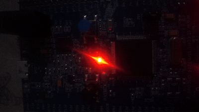

---
sidebar_position: 3
slug: /2-led-toggle-bitwise
title: 2. LED Toggle Using Bitwise Operations
description: Master XOR operations for toggling GPIO pins. Learn efficient bit manipulation for embedded systems.
keywords: [STM32, bitwise, XOR, toggle, GPIO]
---

# Lab 2: LED Toggle Using Bitwise Operations

Now that you understand GPIO output control, let's explore **toggling pins using the XOR bitwise operator** - an elegant technique that doesn't require reading the pin's current state.

## Learning Objectives

By the end of this lab, you will:
- 🎯 Understand **XOR (^) operation** for bit toggling
- 🎯 Master **efficient bitwise techniques** for GPIO control
- 🎯 Implement **toggling without state checking**
- 🎯 Control **multiple LEDs independently** in a loop
- 🎯 Apply **elegant bit manipulation patterns**

## Prerequisites

- ✅ Complete Lab 1 (GPIO fundamentals)
- ✅ Understand bitwise operators (|, &, ~, ^)
- ✅ Familiar with GPIO configuration and ODR register

## Hardware Required

| Component | Details |
|-----------|---------|
| **Microcontroller** | STM32F407VG (STM32F4 Discovery) |
| **LEDs** | PD12 (red), PD13 (orange) |
| **Connection** | Onboard LEDs at GPIOD pins 12-15 |
| **Power Supply** | USB or 5V adapter |

## Theory: XOR Toggling

### The Problem With Traditional Toggle

```c
// To toggle, you normally need to read state:
int state = GPIOD_ODR & (1 << 12);  // Read current
if (state)
    GPIOD_ODR &= ~(1 << 12);        // If ON, turn OFF
else
    GPIOD_ODR |= (1 << 12);         // If OFF, turn ON
```

### The XOR Solution

The **exclusive OR (XOR)** operation has a special property: **A ^ 1 always flips the value**.

```
Truth Table:
0 ^ 1 = 1   ← 0 becomes 1
1 ^ 1 = 0   ← 1 becomes 0
```

So: `GPIOD_ODR ^= (1 << 12);` toggles the pin in **one instruction**!

### Running Code

```c
// Enable GPIOD clock
RCC_AHB1ENR |= (1 << 3);

// Configure PD12 and PD13 as output
GPIOD_MODER &= ~(3U << 24);
GPIOD_MODER |= (1U << 24);
GPIOD_MODER &= ~(3U << 26);
GPIOD_MODER |= (1U << 26);

// Toggle loop
while (1) {
    GPIOD_ODR ^= (1 << 12);  // Toggle red LED
    GPIOD_ODR ^= (1 << 13);  // Toggle orange LED
    delay();
}
```

## Demo



*Red and orange LEDs toggling in unison*

## Complete Code

```c
#define RCC_BASE 0x40023800UL
#define RCC_AHB1ENR *(volatile unsigned int*)(RCC_BASE + 0x30U)

#define GPIO_D_BASE 0x40020C00UL
#define GPIOD_MODER *(volatile unsigned int*)(GPIO_D_BASE + 0x00U)
#define GPIOD_ODR   *(volatile unsigned int*)(GPIO_D_BASE + 0x14U)

void led_delay(void) {
    for (volatile int i = 0; i < 500000; i++);
}

int main(void) {
    // Enable GPIOD clock
    RCC_AHB1ENR |= (1U << 3);
    
    // Configure PD12 and PD13 as outputs
    GPIOD_MODER &= ~(3U << 24);
    GPIOD_MODER |= (1U << 24);
    GPIOD_MODER &= ~(3U << 26);
    GPIOD_MODER |= (1U << 26);

    while (1) {
        // Toggle using XOR
        GPIOD_ODR ^= (1U << 12);
        GPIOD_ODR ^= (1U << 13);
        led_delay();
    }
    
    return 0;
}
```

## Expected Output

Red and orange LEDs blink in synchronization at approximately **0.25 Hz** (one complete cycle per 4 seconds).

## Common Mistakes

| Issue | Solution |
|-------|----------|
| LEDs don't respond | Verify MODER bits are 01 for output |
| Using \|- instead of ^= | Use `^=` for toggle, `\|=` for set, `&=` for clear |
| No visible toggling | Increase delay value |
|Forgot `volatile` keyword | Add `volatile` to register pointers |

## Key Takeaways

✨ **Remember:**
1. **XOR with 1** always flips a bit
2. No need to read state before toggling
3. Bitwise operations are fundamental in embedded systems
4. Multiple independent toggles in sequence work perfectly

## Challenge Exercises

### Challenge 1: Four-LED Pattern
Toggle all 4 LEDs (pins 12, 13, 14, 15) in sequence.

### Challenge 2: Alternating Pattern
Create: Red ON → Orange OFF → Green ON → Blue OFF

### Challenge 3: LED Pulse
Implement a pattern where LEDs light up sequentially, then turn off sequentially.

## Next Steps

🚀 **Ready for Lab 3?** Learn to **read GPIO input** from a push button and control LED output!

Prerequisites for Lab 3: GPIO output control, Understanding bitwise operations