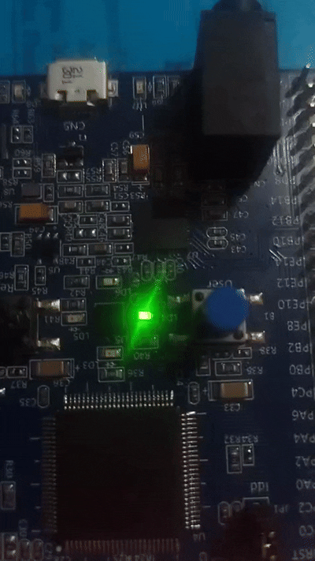

---
sidebar_position: 8
slug: /6-buzzer-control-basic
title: 6. Buzzer Control (Basic)
description: Generate simple sounds on an active buzzer. Learn duty cycle and pulse control for audio output.
keywords: [STM32, buzzer, sound, audio, GPIO, pulses]
---

# Lab 6: Buzzer Control (Basic)

Learn to control an **active buzzer** by toggling GPIO at specific frequencies. This introduces **audio output** and **timing-based pulse generation**.

## Learning Objectives

By the end of this lab, you will:
- 🎯 Understand **active vs passive buzzers**
- 🎯 Generate **sound through GPIO toggling**
- 🎯 Control **buzzer frequency** via delay timing
- 🎯 Implement **pulse patterns** for different tones
- 🎯 Create **simple beep sequences**

## Prerequisites

- ✅ Complete Lab 1 (GPIO output control)
- ✅ Understand delays and timing
- ✅ Familiar with loops

## Hardware Required

| Component | Details |
|-----------|---------|
| **Microcontroller** | STM32F407VG |
| **Buzzer** | Active buzzer module on I/O pin |
| **Connection** | GPIO pin to buzzer (typically through resistor) |
| **Power** | Buzzer typically 5V or 3.3V |

## Theory: How Buzzers Work

### Active vs Passive

**Active Buzzer:**
- Has built-in oscillator
- Just toggle GPIO ON/OFF → makes sound
- Frequency determined by toggle speed
- Easier to use (our case)

**Passive Buzzer:**
- No internal oscillator
- Need to generate frequency
- More control, more complex

### Sound Generation

```
GPIO state over time:
┌─ Toggle ON:  Pin = 3.3V → Buzzer energizes → BEEP
├─ Toggle OFF: Pin = 0V   → Buzzer de-energizes → Silence
├─ Repeat
└─ Toggle rate determines frequency (pitch)

Faster toggle (short delay)  → Higher pitch
Slower toggle (long delay)  → Lower pitch
```

## Demo



*Listen to different frequencies: high pitch, medium pitch, low pitch*

## Complete Code

```c
#define RCC_BASE 0x40023800UL
#define RCC_AHB1ENR *(volatile unsigned int*)(RCC_BASE + 0x30U)

#define GPIO_D_BASE 0x40020C00UL
#define GPIOD_MODER *(volatile unsigned int*)(GPIO_D_BASE + 0x00U)
#define GPIOD_ODR   *(volatile unsigned int*)(GPIO_D_BASE + 0x14U)

void delay(int t) {
    for (volatile int i = 0; i < t; i++);
}

void buzz_tone(int delay_value, int duration) {
    // Generate tone for specified duration
    for (int i = 0; i < duration; i++) {
        // Toggle ON
        GPIOD_ODR |= (1U << 12);
        delay(delay_value);
        
        // Toggle OFF
        GPIOD_ODR &= ~(1U << 12);
        delay(delay_value);
    }
}

int main(void) {
    // Enable GPIOD
    RCC_AHB1ENR |= (1U << 3);
    
    // PD12 as output
    GPIOD_MODER &= ~(3U << 24);
    GPIOD_MODER |= (1U << 24);
    
    while (1) {
        // High pitch (short delay = fast toggle)
        buzz_tone(200, 500);
        
        delay(1000000);  // Silence gap
        
        // Medium pitch
        buzz_tone(600, 500);
        
        delay(1000000);  // Silence gap
        
        // Low pitch (long delay = slow toggle)
        buzz_tone(1200, 500);
        
        delay(1000000);  // Silence gap
    }
    
    return 0;
}
```

## Algorithm

```
buzz_tone(delay_value, duration):
  for i = 0 to duration:
    ├─ Pin HIGH
    ├─ Delay for delay_value
    ├─ Pin LOW
    ├─ Delay for delay_value
    └─ (Loop creates square wave)

Smaller delay_value → faster toggle → higher pitch
Larger delay_value  → slower toggle → lower pitch
Duration controls how long tone plays
```

## Expected Output

```
Timeline:
├─ t=0s:   High pitch beep for ~1 second
├─ t=2s:   Medium pitch beep
├─ t=4s:   Low pitch beep
├─ t=6s:   Silence, then repeat
```

**Audible:** Clearly distinct three-tone pattern repeating.

## Understanding Delay

- **delay(200):** ~200 loop iterations → HIGH 200 iterations + LOW 200 iterations → ~400 total → fast toggle → high pitch
- **delay(1200):** ~1200 iterations → HIGH 1200 + LOW 1200 → ~2400 total → slow toggle → low pitch

## Common Mistakes

| Issue | Solution |
|-------|----------|
| No sound | Verify GPIO pin is output, buzzer powered |
| Sound too quiet | Check power supply to buzzer |
| Wrong pitch | Adjust delay value (smaller = higher pitch) |
| Buzzer doesn't stop | Not toggling OFF, check `&= ~(1 << 12)` |

## Key Takeaways

✨ **Remember:**
1. **Active buzzers** only need GPIO ON/OFF toggling
2. **Toggle frequency** determines pitch
3. **Shorter delay** = higher pitch, **longer delay** = lower pitch
4. **50% duty cycle** (equal ON/OFF time) creates square wave
5. **Frequency = 1 / (2 × delay_time)**

## Challenge Exercises

### Challenge 1: Musical Scale
Generate 8 different pitches (C, D, E, F, G, A, B, C).

### Challenge 2: Melody
Play a simple melody (e.g., "Mary Had a Little Lamb").

### Challenge 3: Button Control
Add button to start/stop buzzer or change pitch.

## Next Steps

🚀 **Ready for Lab 7?** Learn **tone generation with variable frequencies** for musical applications!

Prerequisites for Lab 7: Buzzer control, Understanding frequency/pitch