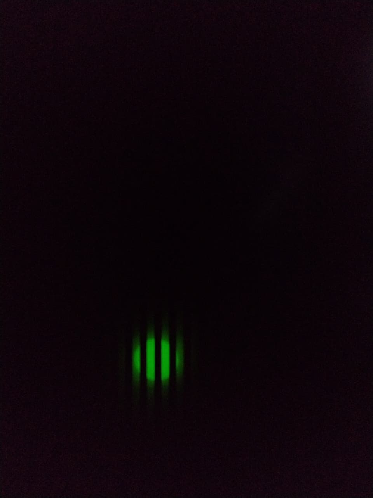

---
sidebar_position: 9
slug: /7-tone-generation
title: 7. Tone Generation
description: Generate musical tones with precise frequencies. Create tonal sequences using mathematical relationships.
keywords: [STM32, tone, frequency, music, pitch, audio synthesis]
---

# Lab 7: Tone Generation

Build on buzzer control to generate **specific musical tones** with defined frequencies. Learn the **mathematical relationship** between delay and frequency.

## Learning Objectives

By the end of this lab, you will:
- 🎯 Understand **frequency and pitch relationships**
- 🎯 Calculate **delays from desired frequencies**
- 🎯 Generate **musical scale tones**
- 🎯 Implement **note structures** with duration
- 🎯 Create **programmable tone sequences**

## Prerequisites

- ✅ Complete Lab 6 (buzzer control)
- ✅ Understand delay timing
- ✅ Basic music knowledge (optional but helpful)

## Hardware Required

| Component | Details |
|-----------|---------|
| **Microcontroller** | STM32F407VG |
| **Buzzer** | Active buzzer |
| **Connection** | GPIO to buzzer |

## Theory: Frequency Calculation

### Frequency and Delay

```
For a square wave:
Frequency (Hz) = 1 / (2 × Delay_in_seconds)

Or rearranged:
Delay = CPU_cycles / (2 × Desired_Frequency_Hz)

Common musical frequencies (Hz):
C4:  262 Hz
D4:  294 Hz
E4:  330 Hz
F4:  349 Hz
G4:  392 Hz
A4:  440 Hz (reference pitch)
B4:  494 Hz
C5:  523 Hz
```

### Musical Scale Relationship

Each octave doubles the frequency:
- A4 = 440 Hz
- A5 = 880 Hz (double)

Each semitone multiplies by 2^(1/12) ≈ 1.0595

## Demo



*Precise tones play in sequence: create musical patterns*

## Example: Musical Note

```c
// Structure for musical note
struct Note {
    int frequency;    // Hz
    int duration_ms;  // How long to play
};

Note song[] = {
    {262, 500},  // C4 for 500ms
    {294, 500},  // D4
    {330, 500},  // E4
    {349, 500},  // F4
    {392, 1000}, // G4 long
};
```

## Complete Code Example

```c
#define RCC_BASE 0x40023800UL
#define RCC_AHB1ENR *(volatile unsigned int*)(RCC_BASE + 0x30U)

#define GPIO_D_BASE 0x40020C00UL
#define GPIOD_MODER *(volatile unsigned int*)(GPIO_D_BASE + 0x00U)
#define GPIOD_ODR   *(volatile unsigned int*)(GPIO_D_BASE + 0x14U)

// Musical note frequencies (Hz)
#define C4 262
#define D4 294
#define E4 330
#define F4 349
#define G4 392
#define A4 440
#define B4 494
#define C5 523

struct Note {
    int freq;
    int duration;
};

void delay_us(int microseconds) {
    for (volatile int i = 0; i < microseconds; i++);
}

void play_tone(int frequency, int duration_ms) {
    // Calculate delay between toggles
    int delay_us = 500000 / frequency;  // Adjust for your CPU speed
    int cycles = duration_ms * 1000 / (2 * delay_us);
    
    for (int i = 0; i < cycles; i++) {
        GPIOD_ODR |= (1U << 12);   // ON
        delay_us(delay_us);
        GPIOD_ODR &= ~(1U << 12);  // OFF
        delay_us(delay_us);
    }
}

int main(void) {
    RCC_AHB1ENR |= (1U << 3);
    GPIOD_MODER &= ~(3U << 24);
    GPIOD_MODER |= (1U << 24);
    
    // Define a simple melody (do-re-mi)
    Note melody[] = {
        {C4, 500},  // Do
        {D4, 500},  // Re
        {E4, 500},  // Mi
        {0, 500},   // Rest (0 = no sound)
    };
    
    while (1) {
        for (int i = 0; i < 4; i++) {
            if (melody[i].freq > 0) {
                play_tone(melody[i].freq, melody[i].duration);
            } else {
                // Rest - just delay
                for (volatile int j = 0; j < 150000000; j++);
            }
        }
    }
    
    return 0;
}
```

## Expected Output

```
Play sequence:
├─ C4 (Middle C) clear tone for 500ms
├─ D4 (Re) slightly higher for 500ms
├─ E4 (Mi) higher still for 500ms
├─ Silence for 500ms
└─ Repeat

Result: Recognizable musical phrase
```

## Musical Scale Example

```c
// Play major scale C to C
int scale[] = {C4, D4, E4, F4, G4, A4, B4, C5};

for (int i = 0; i < 8; i++) {
    play_tone(scale[i], 250);  // 250ms each note
}
```

## Common Mistakes

| Issue | Solution |
|-------|----------|
| Tones sound wrong | Check frequency calculations - may need scaling |
| Tones blend together | Add silence between notes (rest) |
| CPU can't keep up | Simplify calculation, adjust timing |
| Unrecognizable melody | Verify note sequence and durations |

## Key Takeaways

✨ **Important:**
1. **Frequency formula:** `f = 1 / (2 × delay)`
2. **Musical scale** follows mathematical relationships
3. **Note durations** control rhythm
4. **Rests (0 frequency)** provide silence
5. **Tempo = 1 / duration** (faster if duration smaller)

## Challenge Exercises

### Challenge 1: Famous Melody
Implement "Twinkle Twinkle Little Star" or "Happy Birthday".

### Challenge 2: Tempo Control
Play same melody at different speeds (fast/normal/slow).

### Challenge 3: Scale Generator
Play all notes from C4 to C5 with calculated frequencies.

## Next Steps

🚀 **Ready for Lab 8?** Learn **timer-based LED blinking** for precise timing without software delays!

Prerequisites for Lab 8: Understanding frequency and timing