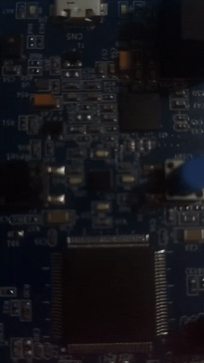

---
sidebar_position: 10
slug: /8-timer-based-led-blink
title: 8. Timer-Based LED Blink
description: Eliminate software delays using hardware timers. Learn timer configuration, overflow flags, and interrupts.
keywords: [STM32, timer, TIM2, overflow, interrupt, precise timing]
---

# Lab 8: Timer-Based LED Blink

Instead of **software delays** (which block CPU), use **hardware timers** for precise, non-blocking timing. This is professional embedded practice.

## Learning Objectives

By the end of this lab, you will:
- 🎯 Understand **hardware timer operation**
- 🎯 Configure **timer prescalers and periods**
- 🎯 Read **status registers** for timer events
- 🎯 Implement **non-blocking timing**
- 🎯 Apply **interrupt-free timer polling**

## Prerequisites

- ✅ Complete Lab 1 (GPIO fundamentals)
- ✅ Understand register configuration
- ✅ Familiar with clock basics

## Hardware Required

| Component | Details |
|-----------|---------|
| **Microcontroller** | STM32F407VG (16MHz clock) |
| **Timer** | TIM2 (32-bit general-purpose timer) |
| **LED** | PD12 red LED |

## Theory: Hardware Timers

### Why Use Timers?

```
Software delays (Lab 1):
  while (running) {
     CPU busy looping ← Wasting CPU cycles
  }

Timer-based (Lab 8):
  Configure timer → Start → CPU free for other tasks
                         → Timer counts independently
```

### TIM2 Configuration

```
TIM2 Features:
- 32-bit counter (0 to 4,294,967,295)
- Programmable prescaler (PSC)
- Programmable auto-reload (ARR)
- Status register with overflow flag

Clock Path:
CPU Clock (16 MHz)
  ↓
PSC divider (0 to 65535)
  ↓
Counting clock
  ↓
ARR reload (1 to 65535)
  ↓
Overflow flag / interrupt
```

### Calculation

```
Desired timing: 1 second
CPU clock: 16 MHz = 16,000,000 Hz

Setup:
- PSC = 16000 - 1 → Divide by 16000 → 1 kHz counter
- ARR = 1000 - 1  → Reload at 1000 → Timer overflows every 1 second

Overflow frequency = Clock / (PSC + 1) / (ARR + 1)
                   = 16,000,000 / 16,000 / 1,000
                   = 1 Hz (once per second)
```

## Demo



*Precise LED blinking controlled by hardware timer*

## Complete Code

```c
#define RCC_BASE 0x40023800UL
#define RCC_AHB1ENR *(volatile unsigned int*)(RCC_BASE + 0x30U)
#define RCC_APB1ENR *(volatile unsigned int*)(RCC_BASE + 0x40U)

#define GPIO_D_BASE 0x40020C00UL
#define GPIOD_MODER *(volatile unsigned int*)(GPIO_D_BASE + 0x00U)
#define GPIOD_ODR   *(volatile unsigned int*)(GPIO_D_BASE + 0x14U)

#define TIM2_BASE 0x40000000UL
#define TIM2_CR1  *(volatile unsigned int*)(TIM2_BASE + 0x00U)
#define TIM2_SR   *(volatile unsigned int*)(TIM2_BASE + 0x10U)
#define TIM2_CNT  *(volatile unsigned int*)(TIM2_BASE + 0x24U)
#define TIM2_PSC  *(volatile unsigned int*)(TIM2_BASE + 0x28U)
#define TIM2_ARR  *(volatile unsigned int*)(TIM2_BASE + 0x2CU)

int main(void) {
    // Enable GPIO clock
    RCC_AHB1ENR |= (1U << 3);
    
    // Configure PD12 as output
    GPIOD_MODER &= ~(3U << 24);
    GPIOD_MODER |= (1U << 24);
    
    // Enable TIM2 clock
    RCC_APB1ENR |= (1U << 0);
    
    // Configure timer for 1 second overflow
    // Clock: 16 MHz
    // PSC: 16000-1 → Divide to 1 kHz (each count = 1ms)
    TIM2_PSC = 16000 - 1;
    
    // ARR: 1000-1 → Count to 1000 = 1 second
    TIM2_ARR = 1000 - 1;
    
    // Start timer (set CEN bit)
    TIM2_CR1 |= (1 << 0);
    
    while (1) {
        // Check if timer overflowed (UIF = Update Interrupt Flag)
        if (TIM2_SR & (1 << 0)) {
            // Clear the flag
            TIM2_SR &= ~(1 << 0);
            
            // Toggle LED
            GPIOD_ODR ^= (1U << 12);
        }
    }
    
    return 0;
}
```

## Algorithm

```
Setup Phase:
  ├─ Enable RCC clock for GPIOD and TIM2
  ├─ Configure PD12 as output
  ├─ Set PSC = 16000-1 (divides 16MHz to 1kHz)
  ├─ Set ARR = 1000-1 (timer overflows every 1000 counts)
  └─ Start timer (CR1.CEN = 1)

Loop Phase:
  while (true):
    ├─ Check TIM2_SR bit 0 (overflow flag)
    ├─ If set:
    │  ├─ Clear flag (prevent re-entry)
    │  └─ Toggle LED
    └─ Continue checking (non-blocking)
```

## Expected Output

```
LED Behavior:
├─ Blinks precisely every 1 second
├─ No CPU utilization in delays
├─ Can run other code while timer counts
└─ Rock-solid timing
```

## Common Mistakes

| Issue | Solution |
|-------|----------|
| Timer doesn't work | Enable APB1 clock for TIM2 |
| LED doesn't toggle | Check SR flag reading and clearing |
| Wrong timing | Recalculate PSC and ARR for your clock |
| Flag never sets | Verify timer started (CR1.CEN = 1) |

## Key Takeaways

✨ **Important:**
1. **Hardware timers** are independent of CPU
2. **PSC + ARR** determine overflow time
3. **Check and clear** status flags in loop
4. **Non-blocking** - CPU free for other tasks
5. **Professional approach** in embedded systems

## Challenge Exercises

### Challenge 1: Variable Speed
Use button to change blink speed (fast/normal/slow).

### Challenge 2: Multiple Timers
Use TIM3 and TIM4 for different blink rates on different LEDs.

### Challenge 3: PWM LED Control
Configure timer in PWM mode to control LED brightness.

## Next Steps

🚀 **Ready for Lab 9?** Learn **external interrupts** using hardware buttons and interrupt handlers!

Prerequisites for Lab 9: Timer understanding, Interrupt basics